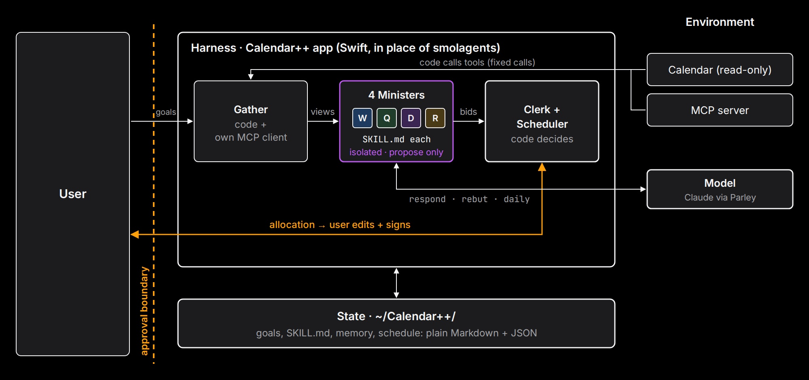

# Calendar++ · Week 2 build notes

*Orange = approval boundary: nothing reaches the schedule until the user signs. Purple = isolation: the four ministers can't see each other and never call tools. They only propose; code decides.*

## Why Swift instead of smolagents

- **It is a native macOS app.** It reads the user's calendar through EventKit and stores the API key in Keychain. It also uses on-device sentence embeddings (NLEmbedding) and launches at login (SMAppService). These are Apple frameworks, reachable from Swift. smolagents is a Python library. Using it would mean bundling a Python runtime inside the app and passing data across a process boundary for every call.
- **The product rule conflicts with a free agent loop.** smolagents' main job is to let the model choose which tool to call next. Calendar++ has the opposite rule: *the model proposes, code decides*. Ministers must not write to the calendar or trigger actions. So the harness calls the tools itself and gives each minister one forced output tool.
- **The same concepts are implemented directly in Swift.** The table below maps each smolagents concept to the file that does that job.

| smolagents concept | Calendar++ (Swift) | File |
|---|---|---|
| Tool interface (name, description, input schema) | JSON-schema tools sent to the Messages API: `respond`, `rebut`, `daily` | `LLM/LLMClient.swift`, `ministers/*/schema.json` |
| Agent loop | Daily list: multi-round loop with `web_search`. It resumes on `pause_turn` and forces `daily` on the last round. The weekly meeting is a fixed pipeline on purpose. | `LLMClient.swift`, `Cabinet/MeetingOrchestrator.swift` |
| Skills | One `SKILL.md` per minister, loaded with that minister's data view and `memory.md` | `Ministers/HarnessLoader.swift` |
| MCPClient | Own MCP client: JSON-RPC 2.0 over stdio and HTTP (initialize, tools/list, tools/call). Tested against `server-everything`. | `Integrations/MCPClient.swift` |
| Memory / state | Plain files the user can open and edit | `~/Calendar++/` |

**Limitation to state openly:** the build does not use the smolagents interface, which the rubric asks for. The model rarely chains tools on its own. The daily list does it (search, then answer), but Parley's endpoint rejects `web_search`, so on Parley that step falls back to a single call. A smolagents version could run as a separate Python agent that reads and writes the same `~/Calendar++` files.

## The weekly flow, in order

1. **Gather (code):** free hours from the calendar, fixed MCP tool calls, and last week's done ticks turned into progress streaks.
2. **Caucus (4 parallel LLM calls):** each minister sees only its own view, SKILL.md and memory, and answers through a forced `respond` tool with bids and actions.
3. **Clerk (code):** splits contested hours by formula (share target × streak boost, capped at 50%). On conflict, each bidding minister first gets one short rebuttal call.
4. **User signs:** the user edits the allocation and signs. Only then does the Scheduler place time blocks and write `schedule.json`.
5. **Daily:** the daily list and reminders come from the schedule. The user's done ticks feed next week's Gather, which closes the loop.

## Tool hygiene notes

- Least privilege: ministers can't act; the calendar is read-only; Telegram text is composed by code.
- Structured I/O: every LLM output goes through a JSON schema, and every tool has a description.
- Side effects need approval: nothing is scheduled before the user signs.
- Secrets stay out of context: `${GITHUB_TOKEN}` is read from a git-ignored `.env`.
- Weak spot: MCP results go into a minister's view as raw text, with no length limit and no injection filtering.

## AI use facts (for the disclosure)

- The Swift code was generated by Claude Code from PLAN.md, phase by phase. NOTES.md records its choices and the owner's later decisions.
- Claude drew this diagram and drafted these notes from the code and NOTES.md.
