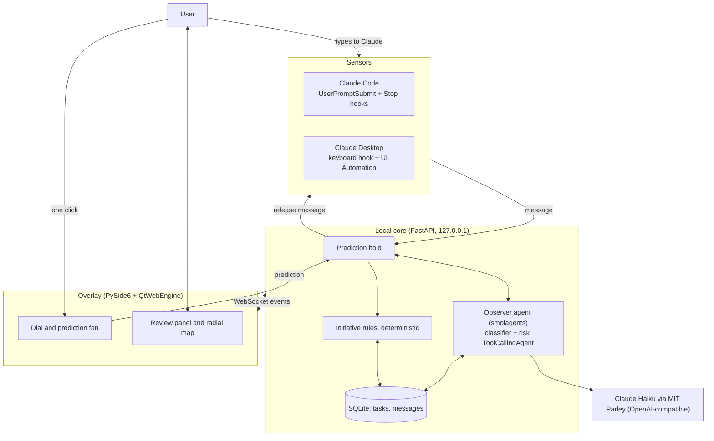

# The Idea: Frontier Map

**A calm desktop agent that trains one cognitive skill: judging what AI can and cannot do.**

Each time the user delegates a task to Claude (in Claude Code or Claude Desktop), a small dial at the
edge of the screen expands and asks for a one-click prediction of how well Claude will do. An observer
agent then watches the conversation, counts the user's corrections, and resolves the outcome. Over time,
a radial dot map shows where the user's expectations of Claude are accurate, where they overestimate it,
and where they underestimate it.

*Images: `images/06_dial_idle.jpg`, `images/07_prediction_warning.jpg`, `images/08_review_panel.jpg`.*
*Demo: `04_demo.mp4`.*

---

## 1. Cognitive augmentation objective

| Item | Content |
|---|---|
| Cognitive domain | Metacognition and decision-making: reasoning about delegation |
| Outcome 1 (primary) | **Calibrated reliance**: trusting AI where it is reliable and withholding trust where it is not, measured as prediction accuracy and Brier score |
| Outcome 2 | **Delegation quality**: deciding what to hand off and how closely to supervise it |
| Outcome 3 | **Mental-model accuracy**: a structured, articulable sense of the AI's strengths and weaknesses by task type |
| Target user | People who delegate to Claude many times a day; the first user is the author |

**Intended benefit.** Every delegation becomes a prediction followed by an outcome, the condition under
which calibration is known to develop. Confident misses are surfaced instead of being fixed and
forgotten. The long-term goal is for the map to be internalized so the tool is no longer needed.

**Risks.** Prediction fatigue; ambiguous success criteria for writing and factual tasks; misclassified
task boundaries or categories; a false sense of mastery when the model changes; an observer effect
(predicting may itself make the user more careful); privacy, because every prompt is read.

**Evidence of success.** Prediction accuracy and Brier score over days; per-category bias shrinking;
fewer revisions caused by overestimation; the share of automatic judgments the user overrides (a check
on the observer itself); a one-line daily self-report.

---

## 2. Interface design

### Form factor and modality
A frameless, transparent, always-on-top **dial** at the right edge of the primary screen. At rest it is a
small dark disc whose dots summarize the user's map. Interaction is visual plus a single mouse click.
There is no chat window and no typing.

### Human-technology relations
| State | Relation | Why |
|---|---|---|
| Idle, observing | Background | The dial stays at the periphery and records quietly |
| Prediction, resolution, review | Hermeneutic | The user reads a representation of their own judgment |
| Overestimation warning | Mild alterity | The agent speaks up briefly but does not open a dialogue |

The agent is deliberately not anthropomorphized: it is a mirror, not a colleague.

### Visual language
Inspired by calm hardware (a Nest-style glass disc), a radial menu (Huly), a two-layer petal chart
(Trove), and a dot-matrix weather widget. The map is a **radial dot field**: seven sectors (task
categories) diffusing outward from the center. How far the lit dots reach shows how well Claude actually
performs; **orange** dots mark where the user expected more than Claude delivered (overestimation);
**hollow** dots mark where Claude did better than expected (underestimation).

### Prediction options
| Option | Meaning | P(first-pass success) for the Brier score |
|---|---|---|
| Certain | Will succeed on the first attempt | 1.00 |
| Likely | Will probably succeed on the first attempt | 0.70 |
| Needs Revision | Will need a few rounds | 0.30 |
| Will Fail | Unlikely to produce a usable result | 0.05 |

Predictions are mandatory: overconfidence on tasks that look easy is the most informative data.

### Outcome rules
| Corrections after the task | Outcome |
|---|---|
| none | First pass |
| 1 or 2 | After revision |
| 3 or more | Failed |

A manual takeover marked during review counts as *After revision* (minor edits) or *Failed* (major
rewrite). An explicit override by the user wins over both.

---

## 3. Human-agent interaction specification

| Component | Specification |
|---|---|
| **Human state** | *Observed:* submitted messages, predictions, corrective follow-ups, review actions (overrides, takeovers, recategorizations). *Inferred:* task boundaries, task category, per-category trust bias, calibration. *Unknown:* completeness of intent, fatigue and attention, sincerity of each prediction. |
| **Agent state** | Current task and category; revision count; tasks awaiting resolution; resolved outcomes; prediction history and bias statistics; overestimation zones; current Claude model version. |
| **Human observations** | At prediction: category and, if relevant, an overestimation warning with the bias. While observing: a slow pulse on the dial. At resolution: a color signal (orange persists with a one-line explanation). Any time: the review panel with the map, forecast, daily trend, and task log. |
| **Agent observations** | Every submitted message (Claude Code via hooks; Claude Desktop via a keyboard hook and UI Automation); the model id from Claude Code transcripts; the user's predictions and review actions. |
| **Human action space** | Send messages as usual; select a prediction (mandatory, one click); cancel and keep editing; view risks; open the review panel; override an outcome; mark a manual takeover; recategorize; resolve now; delete a task; pause the agent. |
| **Agent action space** | Hold a message; segment (new task, correction, follow-up); classify; count revisions; resolve and propose an outcome; signal the result; warn before a task in an overestimation zone; analyze risks on request; notify when the model changes. |
| **Authority** | The agent **executes nothing** and may only hold a message briefly: once a prediction is made it must release the message **unchanged**; it can never modify or discard it. The **user holds final authority** over outcomes and categories. Only the user can delete or reset data or pause the agent. |
| **Initiative policy** | *Silent* unless the category has at least 3 resolved tasks with a mean overestimation of at least 1 tier, in which case it *warns* before the prediction. *Signals* the outcome at resolution, persisting longer for overestimation. *Notifies* when the Claude model changes. These rules are deterministic, not LLM-driven, so behavior is predictable and explainable. |
| **Interaction transitions** | See the state machine below. |
| **Recovery** | Cancel before predicting (the message returns to the editor; in Claude Code the prompt is blocked with a notice). A message is released automatically after 120 s without a prediction. Outcomes, takeovers, and categories can be corrected at any time, and the map recomputes. If Frontier Map is not running, the hooks pass every message through in about 0.1 s. |

### State machine

```mermaid
stateDiagram-v2
    [*] --> Idle
    Idle --> Classifying: Enter in Claude (message held)
    Classifying --> Observing: correction or follow-up (revision +1, released)
    Classifying --> Predicting: new task
    Classifying --> Warning: new task in an overestimation zone
    Warning --> Predicting: dial turns red; optional "View risks"
    Predicting --> Observing: one click; message released
    Predicting --> Idle: "Cancel and keep editing"
    Observing --> Resolving: next new task, or 10 min without follow-up
    Resolving --> Idle: color signal; map updated
    Idle --> Reviewing: click the dial
    Reviewing --> Idle: close; corrections written back
```

**Meaningful transition:** *Classifying → Warning* is driven by the user's own history. The same message
produces a different agent action depending on how the user has predicted in the past.

*See `images/05_state_machine.jpg`.*

---

## 4. Technical overview



| Layer | Implementation |
|---|---|
| Interface | PySide6 frameless transparent window hosting an HTML/SVG/canvas UI; resizes to the interaction state; animations run on compositor layers |
| Model | Claude Haiku 4.5 through MIT Parley (`https://parley.api.mit.edu/v1`), called via LiteLLM |
| Agent loop | smolagents: a `LiteLLMModel` call for segmentation and classification of each message; a `ToolCallingAgent` with two history tools (`category_summary`, `overestimated_tasks`) for risk analysis |
| Harness / runtime | A local FastAPI service holding messages until a prediction arrives; resolution loop; WebSocket event bus |
| Tools | History queries over the local database (agent tools); sensors for Claude Code and Claude Desktop |
| State | SQLite: tasks (prediction, revisions, outcome, override, takeover, model) and messages (task, correction, follow-up) |
| Environment | The user's Claude Code terminals and Claude Desktop window |
| Approval and sandbox boundary | The agent can read and hold, never write: messages are released unchanged; outcomes are proposals the user can override; data never leaves the machine except the text sent for classification |

*See `images/04_architecture.jpg`.*

---

## 5. Implemented vs. simulated

| Component | Status |
|---|---|
| Observer agent (classification, segmentation, risk analysis) | Implemented on smolagents; tested end to end against Claude Haiku via Parley |
| Claude Code sensor (hooks) | Implemented and tested against the running core |
| Claude Desktop sensor | Implemented; reading the prompt box verified on Claude Desktop; the full send path is verified by the user while typing |
| Overlay, review panel, radial map, initiative rules, storage, export | Implemented; 9 automated tests |
| Demo video | Uses the `--demo` database (a week of illustrative history) and a simulated Claude Code window; prompts go through the same endpoint the real Claude Code hook calls, and the dial, agent, and Haiku calls are real |

---

## 6. Evaluation plan

A seven-day self-study using the real database: predict on every delegation, write a one-sentence
daily log, and compare day 1 against day 7 on prediction accuracy, Brier score, per-category bias, and
rework caused by overestimation. `uv run frontier-export` writes the task log and a calibration summary
for analysis. Limitations: a single participant, no control condition, and learning and observer effects.
